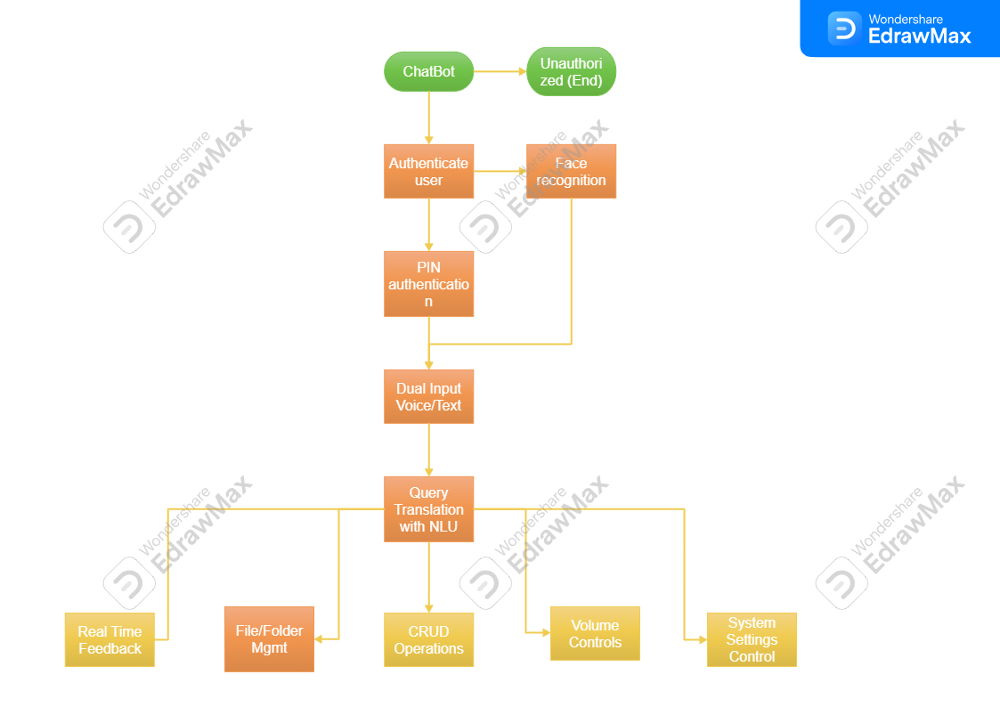

# Ultron-AIAgent-Smart-Automation-for-Your-PC
The solution is an AI-powered desktop assistant that automates tasks (app control, file management, system settings) using voice/text commands. Built with advanced NLP and automation tools, it works on Windows, macOS, Linux, ensures security, and promotes sustainability. It saves time, boosts productivity, and is user-friendly.
  

  

<h2>Functionalities</h2>

Authentication & Security:

Implements authentication mechanisms to restrict access to sensitive files and actions.

Supports PIN-based authentication or face recognition for critical operations.

Ensures unauthorized users cannot perform system-level actions.

Dual Input Modes:

Supports both voice and text commands for flexibility.

Allows users to choose between hands-free interaction or text-based execution.

Query Translation with NLU:

Receives user input through Natural Language Understanding (NLU).

Translates the query into an executable system call.

Example:

User Command: "Create a folder folder1 with files txt1, txt2."

Execution: Automatically creates the specified folder with the mentioned files at the designated path.

File Management via System Calls:

Uses system calls for faster CRUD (Create, Read, Update, Delete) execution.

Enables efficient file and folder management (create, delete, move, rename).

Includes security features to restrict access to private or sensitive files.

System Settings Control:

Controls settings like volume, brightness, and network using Python's os and subprocess modules.

Allows users to modify system settings directly through the chatbot.

Example:

Command: "Set volume to 70%."

Execution: Adjusts the system volume to the specified level.

Seamless Chatbot Integration:

Both file management and system settings can be controlled through the chatbot interface.

Provides real-time feedback confirming the executed actions.